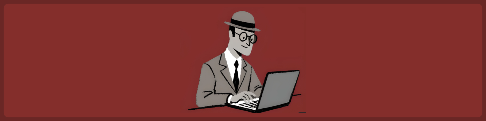

  <h1>Nidhin Joseph Nelson</h1>
  
<em>CS student &nbsp;·&nbsp; Open-source builder &nbsp;·&nbsp; Open to collab</em>

---

<table>
<tr>
<td width="55%" valign="middle">

</td>
<td width="45%" valign="middle" align="left">

### About Me

🛠️ &nbsp;Building projects as both practice and as a hobby  
📚 &nbsp;Currently learning C and exploring data science  
⭐ &nbsp;Actively building open-source and data projects            
🍵 &nbsp;Open to collaborating - reach out anytime

 

</td>
</tr>
</table>
